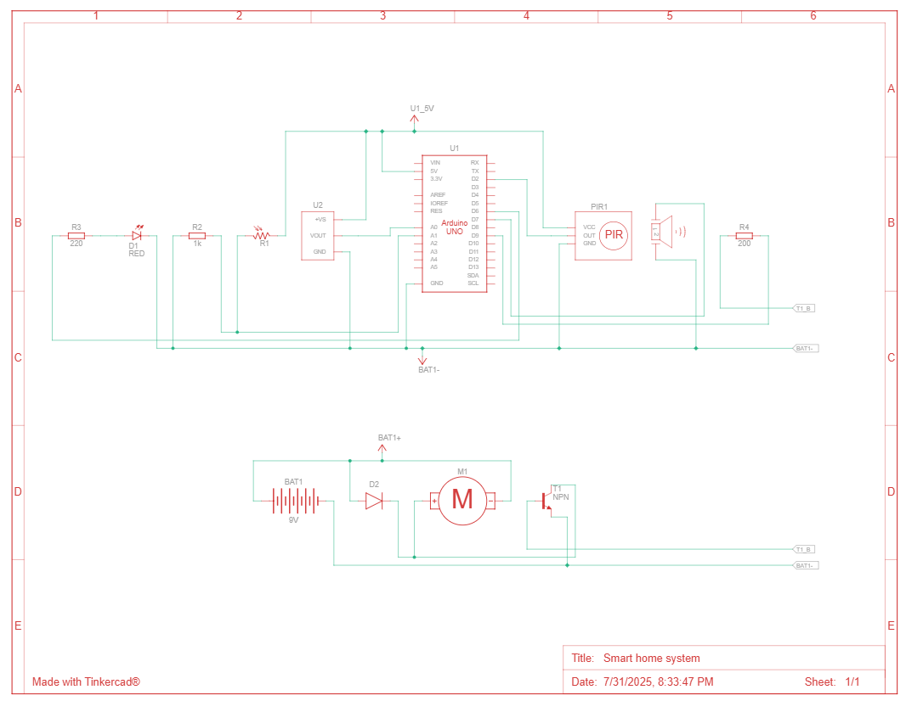
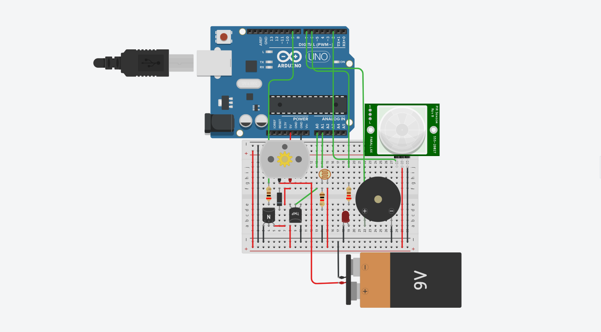

# Smart Home System 🏠

An embedded system application that simulates a smart home environment with sensors, controllers, and automated responses.

## Features
- **Temperature Control**: Automatically activates fan when temperature exceeds 30°C
- **Light Management**: LED lighting based on ambient light levels
- **Motion Detection**: Buzzer alarm system for security
- **Dynamic Memory**: Efficient pointer-based sensor data management
- **Real-time Monitoring**: Serial output for system status

## Hardware Requirements
- Arduino board (Uno/Nano)
- Temperature sensor (LM35)
- Light Dependent Resistor (LDR)
- PIR Motion Sensor
- Fan/Motor, LED, Buzzer
- Breadboard and jumper wires

## Circuit Diagram

## Project Layout

## Pin Configuration
| Component | Pin |
|-----------|-----|
| Temperature Sensor | A0 |
| LDR | A1 |
| PIR Sensor | D2 |
| Fan | D9 (PWM) |
| LED | D6 (PWM) |
| Buzzer | D7 |

## Usage
1. Upload the Arduino code to your board
2. Connect sensors according to pin configuration
3. Open Serial Monitor (9600 baud) to view readings
4. System will automatically respond to environmental changes

## Technical Highlights
- Dynamic memory allocation using `malloc()` and `free()`
- Pointer-based data management
- Real-time sensor processing
- Automated actuator control